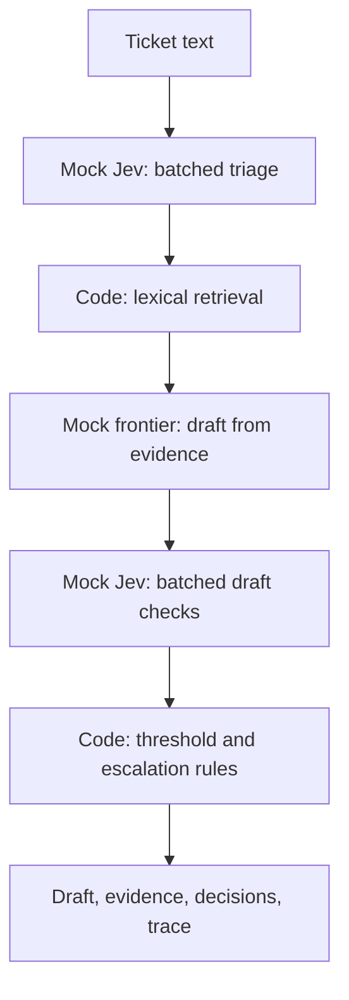

# Architecture: Support Decision Lab

## Decisions
Use Python 3.10+ and the standard library. A CLI keeps setup and execution free and exposes the workflow without hosting, frontend, or database requirements. Data is checked-in JSON; reports are optional JSON files. Provider interfaces permit later real integrations without changing the orchestration.

## Flow

The frontier-only baseline substitutes frontier triage and review for both Jev stages. Retrieval, evidence, routing policy, and evaluation inputs stay identical. In mock mode both adapters share a transparent classification heuristic; this is intentional plumbing validation, not an independent intelligence comparison.

## Components
| Component | Responsibility |
| --- | --- |
| `support_lab/core.py` | Provider protocols, typed decisions, mock adapters, retrieval, routing, trace, evaluation |
| `support_lab/jev.py` | Real HTTP adapter, typed question definitions, response validation, request preview |
| `support_lab/__main__.py` | CLI validation, human-readable output, JSON output |
| `support_lab/data/knowledge.json` | Ten local troubleshooting and policy documents |
| `support_lab/data/tickets.json` | Twelve labeled development/test examples |
| `tests/test_lab.py` | Offline behavioral and CLI tests |

## Contracts
`DecisionProvider.triage(text)` returns a category Choice with its distribution and illustrative confidence, an impact Score with a rubric and distribution, a multi-user Noul, and a deadline Noul. `DecisionProvider.review(text, draft)` returns narrow binary-probability checks. `DraftProvider.draft(text, category, evidence)` returns a draft with evidence IDs. Each triage/review method corresponds to one logical batched provider call.

The mock confidence is the largest category probability, purely for illustration; it is not an implementation of TypeSafe's confidence formula. Mock Noul values have no separate confidence property. Each independent answer is computed from the original state, not from another answer in the batch.

## Routing policy
Code routes to `human_review` if category confidence falls below the configured threshold, category is `other`, the probability of complete blockage is at least 0.5, an explicit deadline is detected, or the draft promises an unverified fix. Impact uses the level probability because real Score values are fractional expectations. Otherwise the outcome is `draft_ready`. This is readiness for human use, never permission to send. All applicable reasons are preserved. Triage escalation is preserved even when later draft checks pass.

## Retrieval and generation
Retrieval restricts candidates to the selected product area and general support guidance, removes common stopwords, then uses token overlap plus category match to select up to three documents with deterministic ID tie-breaking. No embedding API is used. Category-based retrieval is intentionally simple and can miss paraphrases; an incorrect category can exclude useful evidence. The mock draft uses selected document guidance and asks for diagnostics; it does not diagnose root cause. Draft checks are lexical approximations and can miss negation or paraphrases. This limitation is visible in every trace.

## Evaluation
Use `dev` fixtures to experiment with thresholds; reserve `test` for checking the chosen policy. For each mode report category accuracy, urgent-case recall (urgent labeled tickets routed to review / urgent labeled tickets), review rate, and measured local latency. Return null recall when there are no urgent cases. Provider call counts describe orchestration; API cost is exactly zero. The evaluation does not score itself with a mock judge or claim production quality.

## Data and failure handling
In default mode all input remains local and no keys are read. With explicit `--jev real`, the adapter reads TYPESAFE_API_KEY from the process environment and sends ticket/draft text to the fixed TypeSafe HTTPS endpoint using standard-library HTTP. Redirects are disabled. Inputs must be nonempty and at most 10,000 characters. Output files use exclusive creation so existing results cannot be overwritten accidentally. Invalid arguments and filesystem errors result in a nonzero exit status. JSON files are loaded relative to the package, independent of the shell's directory. No customer message is executed as an instruction or shell command.

## Live Jev integration
`RealJev` uses POST https://api.typesafe.ai/v1/systemone with Bearer authentication. Four triage questions run in one request; two review questions run against the resulting draft in a second. It defaults to pinned `jev-1.13.0`. At most two attempts are allowed per adapter, with a configurable 30-second default timeout and no automatic retries. Failures abort the workflow without mock fallback; prior requests may already have incurred charges.

Choice and Score distributions and confidence are taken from the service, not recalculated using mock formulas. Numeric bounds, finite values, keys, distribution sums, answer types, and token counts are validated before routing. Token counts and actual model IDs are logged; authorization and remote error bodies are excluded. Live cost is null (unknown), while offline cost remains zero. This is a call cap, not a dollar budget. The CLI exposes live mode for single-ticket runs only; evaluation stays offline.

Dry-run constructs the same first request without a key. Its second request uses a mock-triaged draft and is explicitly illustrative. It performs no HTTP calls. Tests substitute synthetic HTTP responses and cover serialization, failures, validation, limits, and fractional-score routing. No live smoke test has been performed.

## Learning sequence
1. Inspect T01's trace and identify what each provider decides.
2. Compare it with ambiguous T04 and urgent-but-not-blocked T06.
3. Vary the threshold on development fixtures and inspect review reasons.
4. Run held-out evaluation once the policy is selected.
5. Add negation, conflicting clues, and paraphrase cases to discover mock limitations.
6. Later compare real providers with the same inputs, manual labels, and measured API usage.

## References
Official API concepts checked during planning; these are references, not live dependencies:
- https://docs.typesafe.ai/introduction
- https://docs.typesafe.ai/primitives
- https://docs.typesafe.ai/confidence

The real Jev adapter follows https://docs.typesafe.ai/api and https://docs.typesafe.ai/models, checked September 28, 2026. Recheck these contracts before upgrading model versions. Frontier drafting remains mocked.
